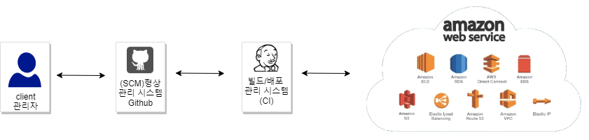
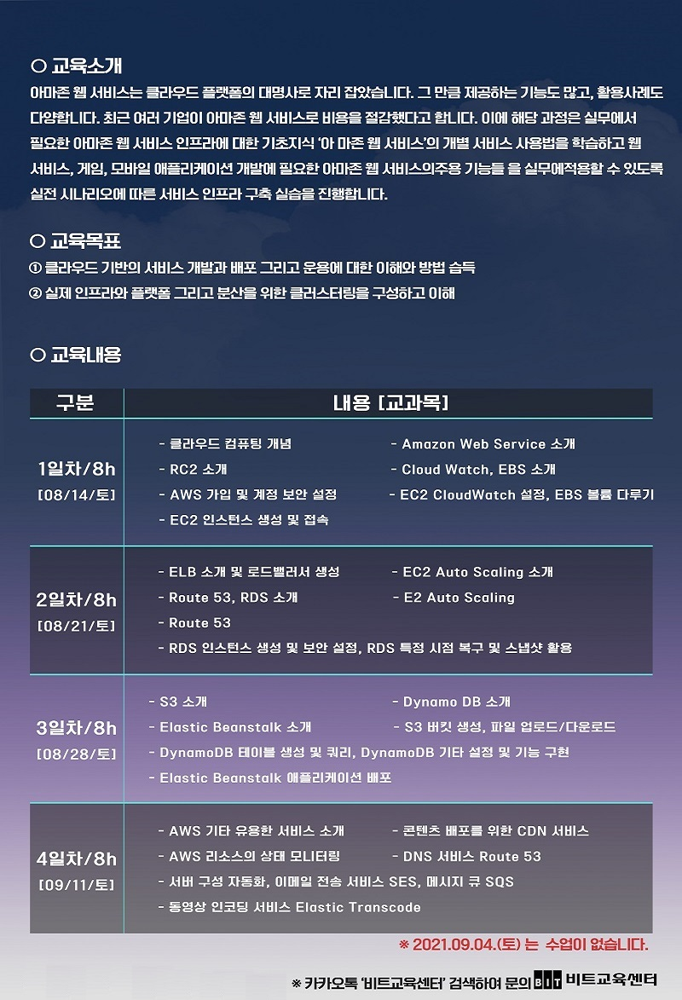

# [AWS Practice 😄](https://github.com/aws-bitacademy)

```text
과정명   :  비트 교육센터 주말 재직자 교육
레포소개 :  노트 정리
교육기간 :  2021-08-14 ~ 2021-09-11
```

<br />
<br />




## [01. AWS 개요](./01/readme.md)

## [02. virtual infra 구축](./02/readme.md)

## [03. data 저장](./03/readme.md)

## [04. web app 제작](./04/readme.md)

<br />
<br />


<br />

[비트 AWS교육 팜플렛 / 출처 비트교육센터 / 용도 학습](https://www.bitcamp.co.kr/)

<br />



<br />

[비트 AWS교육 팜플렛 / 출처 비트교육센터 / 용도 학습](https://www.bitcamp.co.kr/)
